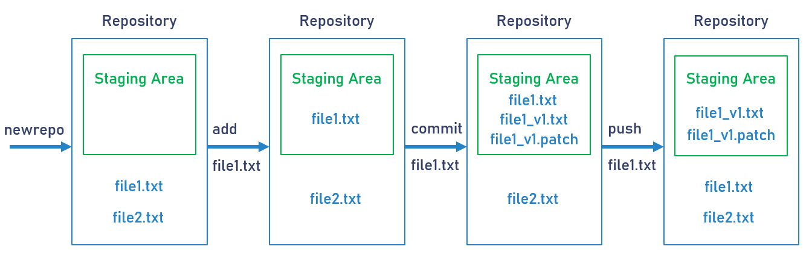
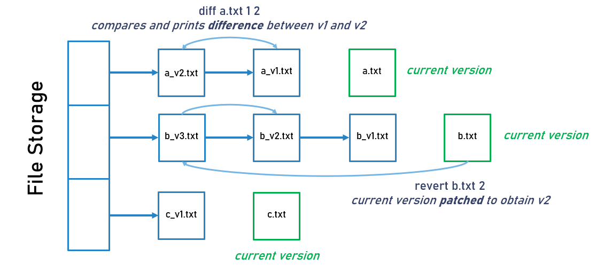

# vcs - version control system

This project is based on the idea of a version control system, a system that records changes 
to a file or set of files over time so that you can recall specific versions later. <br>

### Steps to run the project
```
Step 1 : Clone this repository
Step 2 : Run the command 'make' to compile the required files
Step 3 : Type ./vcs in your terminal to run the project
```
### Features
* *newrepo*    - creates new repository and initializes staging area 
* *changerepo* - changes current directory to repository entered 
* *add*        - adds file to staging area and sets the head accordingly 
* *commit*     - creates node with filename and patchfile of the current version and attaches it to the file storage 
* *push*       - current version file in staging area is patched and original file is moved back to root of repository 
* *revert*     - file is reverted back to a previous version retaining all versions of the file 
* *diff*       - shows difference between two versions of a file 

### Working of VCS


### Revert and Diff between versions of a file

